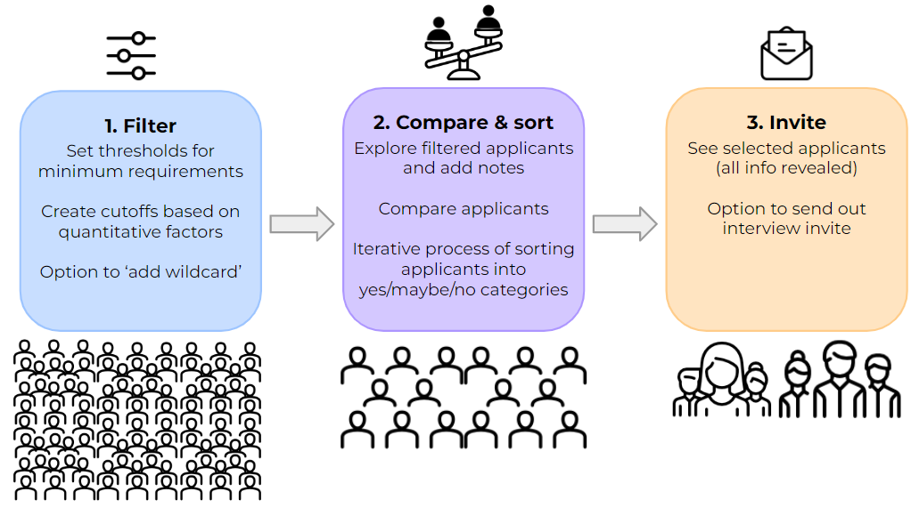

<div id="top"></div>
<div align="center">
  
<h2 align="center">A bias-diminishing applicant shortlisting tool</h2>
  

  <p align="center">
    Human Computer Interaction Exam - MSc Cognitive Science at Aarhus University - Spring 2022
  <br /> <br />
  <em> By <a href="https://github.com/KiriKoppelgaard"><strong>Kiri Koppelgaard</strong></a>, <a href="https://github.com/thearol"><strong>Thea Rolskov Sloth</strong></a> & <a href="https://github.com/idabh"><strong>Ida Bang Hansen</strong></a>  </em>
  <br />
  </p>
</div>

## About The Project

This repository contains our project for the Human-Computer Interaction exam at the Msc Cognitive Science at Aarhus University, spring 2022.

We here present ScreenAid, a software tool to diminish biodemographic biasses in the task of shortlisting job applicants for interviews. Research shows that recruiters are prone to biasses and often discriminate based on irrelevant biodemographic factors such as age, sex, and ethnicity when screening job applicants. ScreenAid aims to combat these problems by presenting anonymised, relevant information to best support comparison between candidates. It facilitates a narrowing process through different steps of filtering, browsing, comparing, sorting, and inviting applicants for interviews.

<div align="center">

</div>
  
## Get started
* Clone the repository
   ```sh
   git clone https://github.com/idabh/HCI-exam
   ```
* Install required modules
  ```sh
  pip install -r requirements.txt
  ```
* Launch the Streamlit application
  ```sh
  streamlit run main.py
  ```


## Contact
Ida Bang Hansen - idabanghansen@gmail.com
<br />
Kiri Koppelgaard - kiri.koppelgaard@gmail.com
<br />
Thea Rolskov Sloth - thearollesloth@gmail.com
